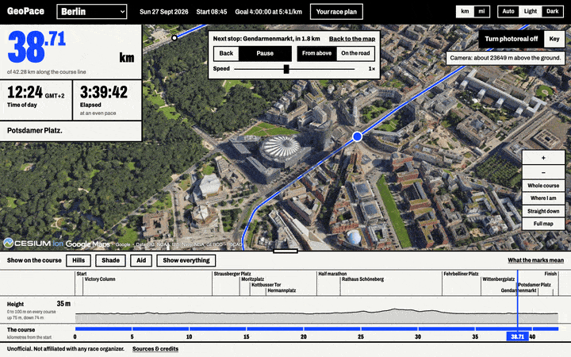
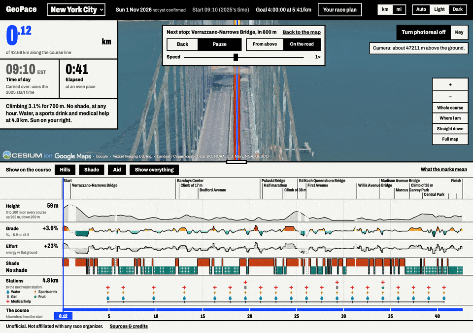
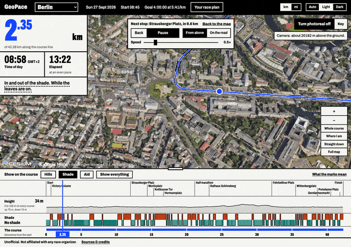
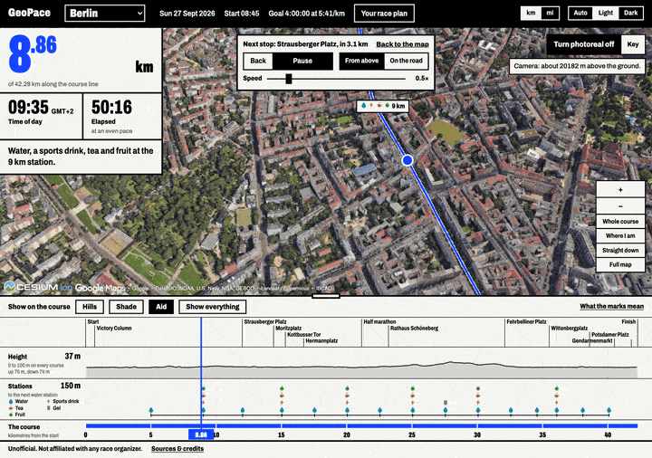
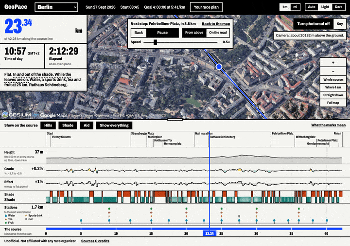
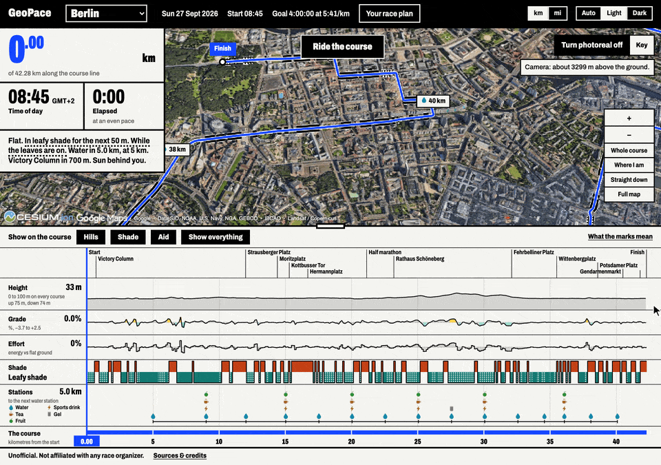
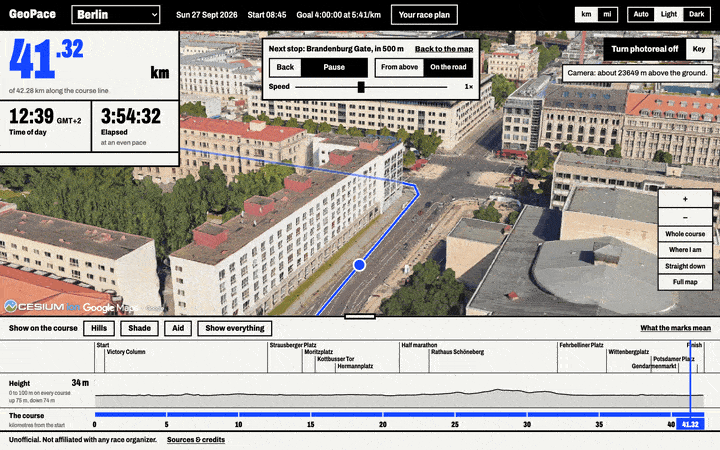
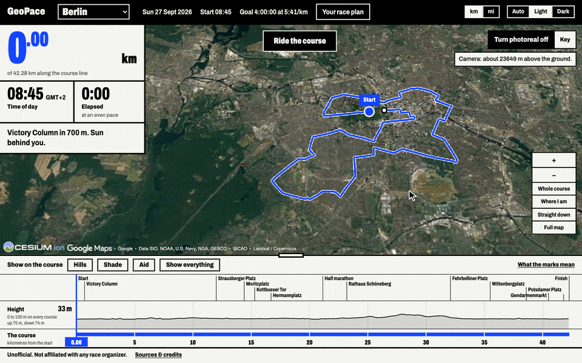
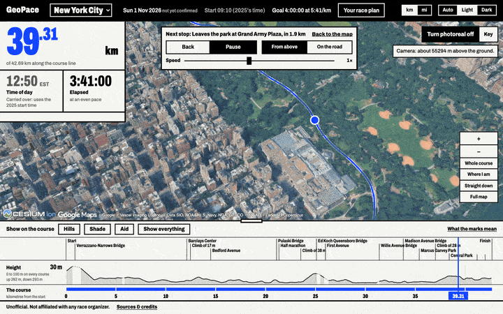

<div align="center">

# GeoPace

### Run the course before race day.

The Berlin and New York City marathons in 3D, on each city's own open data: every hill, every
shadow and every water station, at the minute you'll reach it.

_The rally driver's roadbook, for the marathon._



<sub>In photoreal, which uses your own Google or Cesium key. Without one, the city stands as its own buildings in plain
white blocks, with race day's shadows.</sub>

**No account, no key, no Python.** Install it with [Pinokio](#one-click-no-terminal) in one click, or
[from the terminal](#terminal). **[→ Quick start](#quick-start)**

</div>

---

<div align="center">

**[Why](#why-this-exists) · [What it does](#what-it-does) · [The first five minutes](#the-first-five-minutes) · [Quick start](#quick-start) · [Keys](#keys-and-what-they-cost) · [How it's built](#how-its-built) · [Data](#data-sources-and-licences)**

</div>

---

## Why this exists

> ✍️ **Owner:** two or three sentences here, in your own voice (issue #50).

---

## What it does

- **Race morning's shadows, on the city's own buildings.** The real buildings along the course stand
  as plain white blocks, from each city's own open data, and their shadows fall where the sun will put
  them at the minute you get there. No key needed.
- **Ride the course.** The runner is carried from the start to the finish: from above, in about a minute
  and a half, or on the road, 250 ft up, in about six. Play it from ¼× to 4×, and drag the map to look
  around while it plays.
- **Hills.** Every climb and descent coloured on the course line by how steep it is, with its grade and
  the effort it costs against flat ground.
- **Shade.** Sun, a building's shade or a tree's, every 10 m of the course, at the minute you reach it.
- **Aid and fueling.** Every station and what it serves, from the organizer's own list. Put your gels in
  the plan and it tells you where the next water is too far away.
- **Your race plan.** A goal time or a pace, your start time from your start card, and the time of day
  at every kilometre or mile. It assumes an even pace, and it says so.
- **Bridges at their real height.** The Verrazzano's upper deck and the Queensboro's lower one, measured
  from New York's LiDAR. The usual terrain models would put the start at sea level.
- **Kilometres or miles, light or dark.**
- **Photoreal, with your own key.** Google's photographed 3D city under the course, and the course drawn
  at the road's own height over it.
- **Every fact has a source.** A height that was filled in rather than measured is greyed out on the
  map, the strip and the sentence, and a time that rests on last year's start is marked carried over.



_New York's start, on the Verrazzano's upper deck. The middle of the main span has no LiDAR returns,
so its height is filled in, and the app says so._

---

## The first five minutes

The clips are in photoreal, with a key. Without one, every view is the same but for the city under it: its
own buildings in white blocks, with race day's shadows.

1. **Pick Berlin.** The app opens on the whole course from above, drawn in blue on plain paper, with the
   city's buildings standing along it. Beside the map: the distance as one giant numeral, the time of
   day, the time since the start, and one sentence about where you are.
2. **Switch on a layer.** Each one marks the course line, adds its own chart to the strip and its own
   clause to the sentence. Here each is on alone, the Ride playing at half speed.

   **Hills.** Every climb and descent banded on the course line, yellow to red going up and aqua to teal
   coming down, the darker the steeper, with the grade and the effort it costs against flat ground.
   Berlin is flat, so here is New York, up and over the Queensboro Bridge into Manhattan:

   

   **Shade.** Sun, a building's shade or a tree's, every 10 m, at the minute you get there: a dark rim
   beside the course line, dotted where the shade is a tree's, and its own row on the strip.

   

   **Aid.** Every station and what it serves, as a chip on the course line with a mark for each thing,
   and the stations as a row on the strip with its key.

   

   **All three at once**, and every chart on the strip reads the same course:

   

   **What the marks mean** explains every mark.

3. **Drag the strip.** The band along the bottom is the whole course. Drag it, click it or use the arrow
   keys, and the runner, the clock and the sentence move together. Without a key, the city's white
   blocks cast the shadows of that minute: zoom in and watch them swing as the morning goes on.

   

   _Every chart on the strip is the same course: height, grade, the effort it costs, shade and the stations._

4. **Press Ride the course.** Watch the city go by from above, or switch to **On the road**. The strip,
   the clock and the sentence keep up. The space bar pauses; drag the map to look around.

   

   _While the Ride plays, the sentence holds for four seconds at a time and says what is true of the road ahead._

5. **Type your goal time.** Open **Your race plan**, type a finish time or a pace, and every kilometre
   gets its time of day. Type in the start time on your start card, and add your gels to check them
   against the stations.

   

6. **Switch to New York City.** Its course is here too, from the Verrazzano to Central Park:

   

7. *(Optional)* **Make it photoreal.** Bring a Cesium ion token or a Google Maps key and see the course
   over Google's photographed city. [What that costs.](#keys-and-what-they-cost)

<details>
<summary>Every control, in one place</summary>

- **The map** moves like any maps app: drag, scroll, Ctrl + drag to tilt, or focus it and use the arrow
  keys and + / −. **Whole course** and **Where I am** fly it there. **Full map** (F) gives it the whole
  screen and **Straight down** (B) looks from directly above, like a paper map.
- **The strip** is the whole course on one axis. Drag it, click it, or focus it and use the arrow keys,
  Page Up / Page Down, Home and End. Drag its **top edge** to make its rows taller or to give the map
  the room. **Show everything** opens every row.
- **The layers** (Hills, Shade, Aid) can all be on at once. Hills colours the course line yellow to deep
  red going up and aqua to deep teal coming down: the darker, the steeper. Shade draws a dark rim
  beside the blue where the road is in shade, dotted where the shade is a tree's. Aid puts a chip on
  the course line at each station, with a mark for everything it serves.
- **The Ride** starts from wherever the runner is. Its player has **Back** (to the Stop just passed),
  play and pause (or the space bar), the two cameras, **Speed** from ¼× to 4×, and **Back to the
  map**. While it plays, the sentence changes every four seconds, long enough to read, and says what is
  true of the stretch ahead. Scrubbing the strip moves the Ride. **Straight down** follows the runner from directly above,
  north up, while the Ride plays on. Drag the map and the camera is yours to turn round the runner;
  **Go back to cinematic** hands it back. If your system asks for reduced motion, nothing glides: the
  Ride steps from Stop to Stop.
- **Your race plan** opens from the banner: the start time, prefilled with the organizer's first start
  (type your own over it), a goal as a finish time or a pace, your fueling, and a table of splits
  whose rows take the runner there. The banner also switches **km and miles** and **light and dark**.
  Your plan and your choices stay in your browser and go nowhere else.
- **Buildings** and **Shadows** are two switches on the map. Shadows are the expensive part: turn
  them off on a computer that can't spare the work.
- Where a start time is last edition's because this one's isn't published, every time that rests on it
  is greyed and marked **carried over**, with the reason. A race date the organizer hasn't stated yet
  is marked **not confirmed**.

The ground's shape comes from a free, keyless terrain service, so the map needs an internet
connection. Without it, the course, the strip, the layers and the Ride all still work, over flat
ground.

</details>

---

## Quick start

### One click, no terminal

[Pinokio](https://pinokio.co) installs and runs apps like this one, and brings its own Node.js and git.

1. Get Pinokio from [pinokio.co](https://pinokio.co) and open it.
2. In Pinokio, choose **Create** in the sidebar and switch to **Download**. Paste
   `https://github.com/Daniwave100/GeoPace` as the **Git URL**, name the folder `geopace`, and press
   **Create**.
3. GeoPace's page runs **Install**, then **Start**, by itself. When the app is ready, **Open GeoPace**
   shows it.

Next time, open GeoPace in Pinokio and it starts again. **Update** fetches the newest GeoPace and
reinstalls; **Reset** clears the installed packages so **Install** starts clean. Tested with
Pinokio 8.0.40 on a Mac.

### Terminal

You need [Node.js](https://nodejs.org/) 22.12 or newer. No Python, no account and no key.

```sh
git clone https://github.com/Daniwave100/GeoPace.git
cd GeoPace/app
npm install
npm run dev
```

Open http://localhost:5173 and pick a course: **Berlin** or **New York City**.

---

## Keys and what they cost

Everything above works without a key. **Make it photoreal** is the one thing that needs one, because
Google's photographed city isn't free to show and GeoPace can't come with a key of its own. It uses
yours:

- a **Cesium ion token** is free for personal, non-commercial use and takes about five minutes;
- a **Google Maps key** needs a Google Cloud project with billing switched on. The first 1,000 loads a
  month are free, then Google charges $6.00 per 1,000. (Checked 2026-09-18; the app links each
  provider's own page.)

Your key stays in your browser. It is never written to GeoPace's files and is sent only to the provider
it belongs to; **Forget my key** removes it. If the imagery can't be had (a refused key, a used-up
allowance, no connection), you are back on the plain map with a message saying why.

Photoreal is for looking at. Its shadows were there on the day the city was photographed, so none of
GeoPace's numbers come from it, which is why the white model steps aside while it is on screen.

---

## How it's built

A Python pipeline turns each city's open data into one file per course, the **Course Bundle**, which
is committed to the repo. The app reads it in the browser and needs no Python, no server and no key.

- **The route** is the organizer's own course file where there is one (Berlin). New York publishes
  none you can download, so the pipeline traces it along OpenStreetMap streets from the city's list of
  closed course streets, checked street by street, with the start line from the course's USATF
  certification.
- **Heights** come from each city's official terrain model, never from GPS, and are smoothed before
  any grade is worked out.
- **Bridges** are missing from those models: they are bare-earth, so the Verrazzano would read as the
  water under it. Berlin's decks come from the city's surface model; New York's from the 2017 city
  LiDAR's bridge-deck returns, on the deck runners actually use.
- **A 3D globe counts heights from the ellipsoid**, a surveyor from sea level: sea level is 32.5 m
  below the ellipsoid in New York and 39.5 m above it in Berlin. The pipeline adds the difference from
  the EGM2008 geoid model to every point, so the course sits on the road over photoreal without
  anything ever being measured off Google's surface.
- **The sun** is worked out with NOAA's equations for every 10 m of the course, every five minutes of
  race day, against the city's own buildings and trees. The app looks up the minute your plan
  puts you there.
- **Race dates and start times** are written down per edition from the organizer's own pages, in the
  race's own time zone. New York's 2026 race falls on the morning the clocks go back.
- **The effort a hill costs** is from [Minetti et al. 2002](https://doi.org/10.1152/japplphysiol.00103.2002),
  and isn't shown for grades outside that model's range.

The decisions behind all of it, and why, are in [PLAN.md](PLAN.md); the words the code uses are in
[CONTEXT.md](CONTEXT.md). The look was chosen from three clickable mockups, still there at
http://localhost:5173/mockups/ while the app runs.

<details>
<summary>Rebuild the course data, run the tests</summary>

You only need this to change the course facts or the pipeline. It needs [uv](https://docs.astral.sh/uv/).

```sh
cd pipeline && uv run geopace build berlin
cd pipeline && uv run geopace build nyc
```

The first run downloads the raw inputs into `pipeline/.cache/`, which is never committed: for Berlin
the official course file and about 300 MB of terrain tiles; for New York the streets along the course,
the 1-ft elevation model block by block and the LiDAR points around each bridge. Both fetch their
city's buildings a kilometre of course at a time (Berlin its trees too), and the worldwide geoid grid
(80 MB, once). Only the corridor along the course is ever fetched, never the whole city. New York's
trees need one file the pipeline won't fetch for you (1.3 GB down the wire, 91 GB unpacked); the build
tells you the two commands.

```sh
cd pipeline && uv run pytest     # pipeline (the real-data checks run once the cache exists)
cd app && npm test               # app
cd app && npm run typecheck
```

```
data/courses/<course>/course.yaml   hand-maintained course facts, each with a source URL
data/courses/<course>/editions/     one file per edition: the race date, start times, aid stations
        │
pipeline/ (Python)                  route → evenly spaced samples → official terrain heights
        │                            → bridge decks → smoothed → grade → difficulty
        │                            → height above the ellipsoid → the sun at every 10 m
        ▼
data/derived/<course>/course-bundle.json   committed; must match schema/course-bundle.schema.json
data/derived/<course>/white-model.json     committed; the buildings along the course, as blocks
        │
        ▼
app/ (TypeScript + CesiumJS)        validates the bundle, draws the course and the strip,
                                    stands the city's buildings beside it with race day's
                                    shadows, and times your race along it
```

</details>

---

## Data sources and licences

| Data | Source | Licence |
|------|--------|---------|
| Berlin course route | [BMW BERLIN-MARATHON course file (2025)](https://www.bmw-berlin-marathon.com/en/your-race/course/) | Course geometry only; file not redistributed |
| Berlin race date, first start and aid stations | [BMW BERLIN-MARATHON race day page](https://www.bmw-berlin-marathon.com/en/your-race/race-day-for-runners) · [course page](https://www.bmw-berlin-marathon.com/en/your-race/course/) | Facts, paraphrased |
| Berlin elevation | [Geoportal Berlin, ATKIS® DGM1](https://gdi.berlin.de/data/dgm1/atom/) | [dl-de/zero-2.0](https://www.govdata.de/dl-de/zero-2-0) |
| Berlin bridge decks | [Geoportal Berlin, ATKIS® DOM1](https://gdi.berlin.de/data/dom/atom/) | [dl-de/zero-2.0](https://www.govdata.de/dl-de/zero-2-0) |
| Berlin buildings | [Geoportal Berlin, Gebäudehöhen (Umweltatlas)](https://www.berlin.de/umweltatlas/nutzung/gebaeudehoehen/) | [dl-de/zero-2.0](https://www.govdata.de/dl-de/zero-2-0) |
| Berlin trees | [Geoportal Berlin, Baumbestand](https://daten.berlin.de/datensaetze/baumbestand-berlin) | [dl-de/zero-2.0](https://www.govdata.de/dl-de/zero-2-0) |
| NYC course streets | [City of New York course street closures (2025)](https://www.nyc.gov/assets/cecm/downloads/pdf/marathon-street-closures-no-parking-2025.pdf) · [NYRR](https://www.nyrr.org/tcsnycmarathon/race-day/the-course) | Facts about which streets the course uses |
| NYC race-date rule and 2025 start times (carried over) | [NYRR 2025 runner guide](https://webassets.nyrr.org/nyrrwebsiteassets/TCSNYCM25_RunnerGuide_Mobile_M.pdf) | Facts, paraphrased |
| NYC aid stations (carried over from 2025) | [NYRR, the course](https://www.nyrr.org/tcsnycmarathon/race-day/the-course) | Facts, paraphrased |
| NYC start line | [USATF course certification NY22001JHP](https://certifiedroadraces.com/certificate/?type=l&id=NY22001JHP) | Published measurement of the certified course |
| NYC elevation | [2017 NYC 1-ft bare-earth DEM](https://www.fisheries.noaa.gov/inport/item/64732) (City of New York, via NOAA Digital Coast) | [NYC Open Data: no usage restrictions](https://opendata.cityofnewyork.us/faq/) |
| NYC bridge decks | [2017 NYC Topobathymetric LiDAR](https://www.fisheries.noaa.gov/inport/item/64728) (City of New York, via NOAA Digital Coast) | as above |
| NYC buildings | [Building Footprints](https://data.cityofnewyork.us/City-Government/Building-Footprints/5zhs-2jue) (City of New York, OTI) | as above |
| NYC trees | [Land Cover Raster Data (2017), 6-inch](https://data.cityofnewyork.us/Environment/Land-Cover-Raster-Data-2017-6in-Resolution/he6d-2qns), with the 2017 LiDAR for their height | as above |
| Height above the ellipsoid, both cities | [EGM2008 geoid model](https://earth-info.nga.mil/index.php?dir=wgs84&action=wgs84) (U.S. National Geospatial-Intelligence Agency), as the [PROJ project's GeoTIFF](https://cdn.proj.org/us_nga_egm08_25.tif) | Public domain |
| The sun's position | [NOAA Solar Calculator](https://gml.noaa.gov/grad/solcalc/calcdetails.html)'s equations | Public domain |
| Landmarks | Wikipedia (Berlin) and the organizers' pages (New York), each linked beside its landmark in `data/courses/<course>/course.yaml` | Facts: a name and a place on the course |
| What the trees are wearing on race day | [German Weather Service, phenological clock](https://www.dwd.de/DE/klimaumwelt/klimaueberwachung/phaenologie/produkte/phaenouhr/phaenouhr.html) (Berlin) · [Central Park Conservancy, fall foliage](https://www.centralparknyc.org/fall-foliage) (New York) | Facts, paraphrased |
| Street geometry, bridge locations | [OpenStreetMap](https://www.openstreetmap.org/copyright) | ODbL |
| 3D terrain | [Re:Earth Terrain](https://terrain.reearth.land/) · [Mapterhorn](https://mapterhorn.com/attribution) | CC BY 4.0 |
| Photoreal 3D city (optional, with your own key) | [Google Photorealistic 3D Tiles](https://developers.google.com/maps/documentation/tile/3d-tiles), direct or through [Cesium ion](https://cesium.com/platform/cesium-ion/pricing/) | [Google's Map Tiles policies](https://developers.google.com/maps/documentation/tile/policies): display only, never stored; Google's logo and data credits stay on the map |

Each course's own list, with the date every source was read, is in its Course Bundle and in the app
under **Sources & credits**.

---

## Status, licence and what's next

**v0.1.0, the first public release.** Two courses: Berlin, Sunday 27 September 2026, and New York City,
whose 2026 date the organizer hasn't confirmed yet and whose start times and aid stations are
2025's until they publish this year's; the app marks each of them. Times assume an even pace. Built
and tested in Chrome on a Mac; the Pinokio install is untested on Windows and Linux.

**Licence.** The code is [MIT](LICENSE). The data keeps its sources' licences (the table above), and
geometry derived from OpenStreetMap is under the ODbL.

**Unofficial.** GeoPace is not affiliated with any race organizer, and carries no race's logo.

**What's next.**

> ✍️ **Owner:** in your own words (issue #50). The layers not built yet, wind (#11) and what runners
> say about the course (#13), can be named here.
